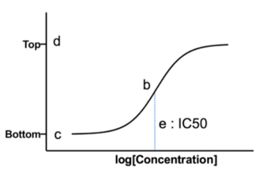
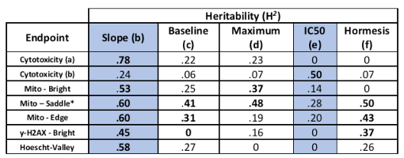

# Project summary

## Important links

- [Box Data Link (remote)](https://thejacksonlaboratory.ent.box.com/folder/87420987160)
- [Proposal Link (local)](./papers/NIEHS_ArsenicProposal_Science.pdf)
- [Methylarsonouse Acid Reference](https://pubchem.ncbi.nlm.nih.gov/compound/Methylarsonous-acid)

## Hypothesis 

_Genetic analysis in the context of a quantitative environmental perturbation will reveal multiple, novel, and diverse biochemical networks that respond to chemical exposure._

## Project Aims

Study design evaluation / statistical methods development (__Aim 1__)
- Sample size determination, GxE (qtl?) mapping, hypothesis formulation
- Dose-response and benchmark dose development / analysis
- Omics data pathways analysis (TBD)
- Subsequent animal / cell-line validation (TBD)

In Vitro Analysis (__Aim 2__)
- Arsenic exposure in primary cell cultures
- Accumulate physiologically informative cellular features / phenotypes in 3 main categories: 
  - cytotoxicity
  - genotoxicity
  - oxidative stress
- Identify genetic factors of susceptibility and resistance (i.e. whole organism response and/or discovered molecular pathways)

In Vivo Renal (__Aim 3__)
- TBD

---

# R package environment

Click on __CODE__ button to view requirements.

```{r message=FALSE}
library(data.tree) # project mapping chunk & file dendrogram
library(DiagrammeR) # project mapping chunk
library(readr)
library(dplyr, warn.conflicts = FALSE)
library(plyr) # for rbind.fill function
library(stringr)
library(drc) # dose response library
library(ggpubr)
library(ggplot2) # for predictor distribution plotting / analysis
library(janitor) # for clean_names() bulk column renaming
library(rstan)
library(multidplyr) # multi-core dplyr
library(factoextra) # PCA Analysis
library(corrplot) # PCA Analysis
# library(gridExtra) # toggle with multi plotting / or use facet_wrap
#library("GGally","parcoords") # parallel coordinates plotting
source("scripts/harmony_utils.R")
source("scripts/tidy_utils.R")
source("scripts/var_analysis.R")
```

---

# Analysis metadata and parameters

## Harmony dataset selection

Currently one master directory can be processed in the following pipeline. This data accesses _./scripts/harmony_utils.R_ for the generation of R friendly plate objects.

```{r}
selected_dir <- "./founders_quantal"

# founder_quantal_plate_list <- harmony_read_plate_2(dir = "./founders_quantal")
# do_unfiltered_plate_list <- harmony_read_plate_2(dir = "./do_unfiltered")
# do_screen_plate_list <- harmony_read_plate_2(dir = "./do_nucleiCounts")
```

__<span style="color:red; font-size:26px;">`r selected_dir`</span>__. was selected in this file's code.

## Parameters

### Proposal parameters

A collection of user-defined values representing stated and proposed values found in project documentation. 

```{r}
metadata <- list(
  exposure_to_labeling_duration_hours = 24, # time from culturing to image ready state
founders_concentration_arr = c(0, 0.1, 0.5, 1, 2, 3, 4, 5), # in ppm
do_concentration_arr = c(0, 0.01, 0.1, 0.75, 1, 1.25, 2, 5), # in ppm
do_sample_size = 250, # proposed sample size
arsenic_exposure_limit = 0.01, # in ppm / existing standard criteria
do_founders = c("AJ", "B6", "129", "NOD", "NZO", "CAST", "PWK", "WSB"),
stains_df = data.frame(
  "stain" = c("mitotracker","h2ax","hoescht"),
  "phenotype_targets" = c("cytotoxicity","genotoxicity","oxidative_stress")
  )
)

knitr::kable(metadata$stains_df, caption="Stains applied")
```

- Manually input variables based on found documentation:
  - exposure to labeling duration (in hours): `r metadata$exposure_to_labeling_duration_hours`
  - arsenic concentrations applied (in ppm): `r length(metadata$concentration_arr)` concentrations; `r metadata$concentration_arr`
  - DO screen proposed individual sample size `r length(metadata$do_sample_size)`

---

# Data loading & tidying

## Loading as custom plate objects 

__Explanation__

- The following loads Harmony-derived data for the following input organization:
  1. set working directory 2 parents above the folder containing each plate derived from a single analysis (i.e. setwd('data/discovery_invitro'))
  2. Run _harmony_read_plate_2()_ on a contained directory which will return a list object containing the data.
  
<pre>
├── data
│   ├── discovery_invitro <- <b>setwd("data/discovery_invitro/") here!</b>
│   │   ├── do_nuclei_counts <- <b>harmony_read_plate_2(dir = "./do_unfiltered")</b>
│   │   │   ├── 20222_A1_2020-08-18T13-18-44_Measurement-2
│   │   │   │   ├── Evaluation2
│   │   │   │   │   ├── Objects_Population\ -\ Nuclei\ Selected.txt <b>(if applicable)</b>
│   │   │   │   │   └── PlateResults.txt
│   │   │   │   └── indexfile.txt
</pre>

```{r message=FALSE, warning=FALSE, echo = FALSE}
# point to masterdata dir
setwd("data/discovery_invitro/")

plate_list <- harmony_read_plate_2(dir = selected_dir)
```

## Generate a master plate data frame

- Creates an amalgamated data.frame from _harmony_read_plate's_ returned list object's constituent plates 

```{r}
plate_list$dFounders_A1_Whole_New__20200115T13_25_19Measurement_1_e1@plate_df <-
plate_list$dFounders_A1_Whole_New__20200115T13_25_19Measurement_1_e1@plate_df %>%
  filter(!is.na(cell_type)) %>% 
  mutate(plate_name = 'A1')

plate_list$dFounders_B1_Whole__20200103T10_34_56Measurement_1_e3@plate_df <- plate_list$dFounders_B1_Whole__20200103T10_34_56Measurement_1_e3@plate_df %>%
  filter(mouse != "PWK_2F") %>% mutate(plate_name = 'B1')

plate_list$dFounders_AA1__20200113T14_27_40Measurement_1_e3@plate_df<-plate_list$dFounders_AA1__20200113T14_27_40Measurement_1_e3@plate_df %>% mutate(plate_name = 'AA1')

plate_list$dFounders_BB1__20200114T09_14_08Measurement_1_e3@plate_df<-plate_list$dFounders_BB1__20200114T09_14_08Measurement_1_e3@plate_df %>% mutate(plate_name = 'BB1')

plate_list$dFounders_C1_Whole__20191230T10_37_26Measurement_1_e2@plate_df<-plate_list$dFounders_C1_Whole__20191230T10_37_26Measurement_1_e2@plate_df %>% mutate(plate_name = 'C1')

plate_list$dFounders_CC1__20200115T09_21_08Measurement_1_e3@plate_df <- plate_list$dFounders_CC1__20200115T09_21_08Measurement_1_e3@plate_df %>% mutate(plate_name = 'CC1')

plate_list$dFounders_D1_Whole__20191230T13_52_41Measurement_1_e2@plate_df<-plate_list$dFounders_D1_Whole__20191230T13_52_41Measurement_1_e2@plate_df %>% mutate(plate_name = 'D1') %>% 
  mutate(sex = "F")

plate_list$dFounders_DD1__20200114T13_08_38Measurement_1_e3@plate_df<-plate_list$dFounders_DD1__20200114T13_08_38Measurement_1_e3@plate_df %>% mutate(plate_name = 'DD1')

plate_list$dFounders_E1_Whole__20200102T08_52_12Measurement_1_e4@plate_df <- plate_list$dFounders_E1_Whole__20200102T08_52_12Measurement_1_e4@plate_df %>% mutate(plate_name = 'E1')
all_plates_df <- do.call(rbind.fill, lapply(plate_list, function(x) {x@plate_df})) %>%
  mutate(concentration = factor(concentration)) %>%
  mutate(cell_type = factor(cell_type)) %>%
  dplyr::rename(strain = cell_type) %>%
  #dplyr::rename(batch = individual) %>%
  filter(sex!='FALSE') %>%
  mutate(strain = factor(strain, levels = c("AJ", "B6", "129", "NOD", "NZO", "CAST", "PWK", "WSB")),
         sex = factor(sex)) %>%
  select_if(function(x) !(all(is.na(x)) | all(x=="") | all(x==0))) %>% # remove empty colunns
  select_if(function(x) length(unique(x)) > 1) %>% # remove rows with identical values
  filter(concentration %in% metadata$founders_concentration_arr | concentration != 'NA') # remove missing concentrations
```

# Customize data

- From this point forward things are not automatic
- The pipeline is not mature and each dataset needs special consideration and relational information.

## Loading supplementary data

- Supplementary tables are contained inside __./lookups__. 

```{r message=FALSE, warning=FALSE}
stain_series_lookup <- readr::read_csv("lookups/stain_info/do_all_plates_df_stainlookup.csv")
all_plates_df_join <- all_plates_df
```

## Modification

- Code block for unique data modification, error checking and custom considerations.

### Feature engineering

```{r}
# nothing right now
```

### Error proofing

```{r}
# remove 0.5 concentrations in DO
#all_plates_df_join<-all_plates_df_join[!(all_plates_df_join$concentration==0.5),]

# missing values?
#sum(is.na(all_plates_df_join$sex))
#setdiff(all_plates_df$individual,doscreen_sample_lookup$sample_1)
```

---

# Schema definition

The following table shows counts for each individual's strain and sex along with the sample plate location. This will include some of the following - sex, plate, concentration, and strain (founders only).

__`r length(unique(all_plates_df_join$individual))`__ individual DO mice for __`r length(all_plates_df_join$individual)`__ total wells. 2 technical replicates per individual per plate. Biological replicates on alternative A or B plates.

- sample data is joined from external csv sample_lookup.csv and growth_lookup.csv
- plate identification is not a plate - this is 'run'. 

```{r}
schema_construction <- all_plates_df_join %>% 
  dplyr::count(plate_name, sex, strain, concentration) %>% 
  tidyr::spread(concentration, n, fill = 0) %>%
  arrange(strain)

DT::datatable(schema_construction, rownames=FALSE, caption="Concentration frequencies by plate_name, sex and strain")
```


### QA Technical Replicates

```{r}
# a1_individuals<-all_plates_df_join[ which(all_plates_df_join$plate=='A1'), ]$individual
# a2_individuals<-all_plates_df_join[ which(all_plates_df_join$plate=='A2'), ]$individual
# b1_individuals<-all_plates_df_join[ which(all_plates_df_join$plate=='B1'), ]$individual
# b2_individuals<-all_plates_df_join[ which(all_plates_df_join$plate=='B2'), ]$individual
# 
# prop_diff_A1A2 <- setdiff(a1_individuals,a2_individuals)
# prop_same_A1A2 <- intersect(a1_individuals,a2_individuals)
# prop_diff_B1B2 <- setdiff(b1_individuals,b2_individuals)
# prop_same_B1B2 <- intersect(b1_individuals,b2_individuals)
# 
# 
# a1_total<-length(unique(a1_individuals))
# a2_total<-length(unique(a2_individuals))
# b1_total<-length(unique(b1_individuals))
# b2_total<-length(unique(b2_individuals))
# 
# schema_vis <- all_plates_df_join %>%
#   dplyr::count(plate, concentration) %>% # may be plate_id
#   tidyr::spread(concentration, n, fill = 0) %>%
#   #arrange(plate) %>%
#   mutate(cumsum = `0`+`0.01`+`0.1`+`0.75`+`1`+`1.25`+`2`+`5`) # sum rows by sex and concentration
# 
# series <- c("A1","A2","B1","B2")
# ## Check if each subset mentions each symptom or not
# concentration_mat <-purrr::map_dfc( series,str_detect,as.character(metadata$do_concentration_arr)) %>%
#     data.frame() %>%
#     t() %>% # transpose the result, ugh
#     as_tibble()
# 
# colnames(concentration_mat)  <- metadata$do_concentration_arr
# concentration_mat$count <- schema_vis$cumsum[1:4]
# 
# concentration_mat %>% print(n = nrow(concentration_mat))


#Proportion of A replicates `r length(prop_diff_A1A2)` different vs `r length(prop_same_A1A2)` same.
#Proportion of B replicates `r length(prop_diff_B1B2)` different vs `r length(prop_same_B1B2)` same.
```


---

# Predictive Analysis

- the following are found and new experimental analyses

## Data Reduction and Variance

- Analysis of _sources of external variation that can influence image analysis and quantification_
- _We observed batch effects and additional sources of variation_ (how?)
  - in sex, litter, freeze/thaw success, replicate number within a well, and differences in cellular labeling.
  - The data was adjusted to correct for these factors prior to dose-response modeling
  - check slide 29 (well-to-well, plate-to-plate, day-to-day)
  
__3 primary predictors selected__
- needs justification from somewhere

 hoescht features
 nuclei count, nuclear area, nuclear roundness, nuclear symmetry, nuclear length, hoescht intensity

 mitotracker
 cell area, cell roundness, cell length, cell symmetry, cell compactness, radial profile, mitotracker-homogeneity, mitotracker intensity, mitotracker intensity
#mitochondrial texture - bright,dark,valley,saddle,edge,spot,hole

 H2AX
 num spots, postive/negative, texture: bright,dark,valley,saddle,edge,spot,hole

micronucleated vs multinucleated cells

1. number of objects
2. mean mitotracker intensity
3. h2ax positive

1. cytotoxicity; mitotracker; micronucleated_cells ; founders_quantal_all_plates_df$micronucleated_cells_cells
2. genotoxicity; H2AX; H2AX_pos/in_focus ; founders_quantal_all_plates_df$h2ax_pos_in_focus
3. mito_stress/in_focus; Hoescht; founders_quantal_all_plates_df$mito_stress_in_focus

## Dose-response & benchmark dose estimation

- Multi-parameter dose response curve fitting summaries
  - Slope
  - EC50

- Used founder strain data to estimate heritability of dose-response parameters
- Heritability estimates for cellular dose response phenotypes were used to establish assay reliability prior to screening DO mice
  - rendering hard-coded images 
  - TBD load these dynamically / reproducibly
  





$$c+(d-c)exp(-exp(b(log(x)-log(e))))$$

- __x__ = dose
- __a__ = count(0 dose)
- __b__ = slope
- __c__ = maximum change
- __d__ = constrains model
- __e__ = ED50

- Check presentations arxenic[sic] presentation.pptx

-H2AX and Mito summaries
-uses quantal dataset
- Example founders' aggregate DR between concentration and in_focus_number_of_objects
- https://rpubs.com/russH/378543 
- chunk turned off

```{r warning=FALSE, eval=FALSE}

# founders code reproduction

#founders_quantal
model_H2AX_W2_4 <- drm(h2ax_pos_in_focus ~ as.numeric(concentration), 
                       curveid = mouse, 
                       data=na.omit(founders_quantal_all_plates_df), 
                       fct=W2.4(), 
                       pmodels = c(~mouse-1, ~mouse-1, ~mouse-1, ~mouse-1)
                       )

#founders_quantal
model_H2AX_LL_4 <- drm(h2ax_pos_in_focus ~ as.numeric(concentration), 
                       curveid = mouse, 
                       data=na.omit(founders_quantal_all_plates_df), 
                       fct=LL.4(), 
                       pmodels = c(~mouse-1, ~mouse-1, ~mouse-1, ~mouse-1)
                       )

#founders_quantal
model_stress_W2_4 <- drm(mito_stress_in_focus ~ as.numeric(concentration), 
                       curveid = mouse, 
                       data=na.omit(founders_quantal_all_plates_df), 
                       fct=W2.4(), 
                       pmodels = c(~mouse-1, ~mouse-1, ~mouse-1, ~mouse-1)
                       )

#founders_quantal
model_stress_LL_4 <- drm(mito_stress_in_focus ~ as.numeric(concentration), 
                       curveid = mouse, 
                       data=na.omit(founders_quantal_all_plates_df), 
                       fct=LL.4(), 
                       pmodels = c(~mouse-1, ~mouse-1, ~mouse-1, ~mouse-1)
                       )
```

### DRC distribution example - DO

- 0.5 concentration ignored
- chunk turned off

```{r eval=FALSE}
## Fitting a four-parameter log-logistic model
## with user-defined parameter names
#names_group <- c('plate_id' ,'technician')
# do
log_nuclei_number_of_objects_LL4 <- drm(
  formula = nuclei_number_of_objects ~ as.numeric(concentration),
  curveid = plate, #given plate id
  data = do_all_plates_df[ do_all_plates_df$concentration != 0.5, ],
  fct = LL.4(names = c("Slope", "Lower Limit", "Upper Limit", "ED50"))
  )

# example plot
plot(log_nuclei_number_of_objects_LL4,  
     xlab="dose response (ppm)", 
     ylab="plate number of objects",
     col = TRUE,
     type = 'all',
     #normal = TRUE,
     #ylab = 'feature value',
     #xttrim = FALSE,
    confidence.level = 0.95,
    main="example drc = Plate x Batch nuclei_number_of_objects")
## Add points
#plot(nuclei_number_of_objects.LL4 ,col = TRUE, add=TRUE)
#provide the four-parameter log-logistic function
summary(log_nuclei_number_of_objects_LL4)
#confint(log_nuclei_number_of_objects_LL4, level = 0.95)
```

### DRC boxplot example - DO

```{r message=FALSE, warning=FALSE, eval=FALSE}
p <- ggplot(
    data = do_all_plates_df, aes(x = concentration, y = nuclei_number_of_objects)
  ) +
  #geom_violin() +
  labs(
    x = "Arsenic Drug Concentration", 
    y = "Number of Objects",
    title = 'Dose-Response Boxplot',
    subtitle = 'log_nuclei_number_of_objects all_plates_df'
    ) +
  ylim(0, NA) + 
  #stat_summary(fun.y=mean, geom="point", shape=23, size=2) + 
  #stat_summary(fun.y=median, geom="point", size=2, color="red")
  geom_boxplot(width=0.1)
p
ignore <- c("plate_name","sex","mouse","individual","strain","concentration","row","column")
dependent_variable_analysis_dr(founders_quantal_all_plates_df,ignore, response_var='concentration')
```

## Cell-line feature selection

## RIX Validation

- are F1 hybrid mice from pairs of CC strains
- recombinant, inbred intercross, RIX mice
- validation strains for AOPs discovered in DO mice
- TBD

## Pathway modeling

- using omics data
- identify predictive biomarkers and 'key molecular events'
- TBD

## GxE mapping strategy

- map and identify genetic loci that are responsible for individual variation in susceptibility in DO mice using a novel G x E mapping strategy

# Future work

ToDo
- nuclei cytotoxicity, mitotracker intensity, gamma-htax positive (3x3)
- 6x6 
- PCA & DRC - analyze sources of variance
- stan tbd - bayes vs weibull.R